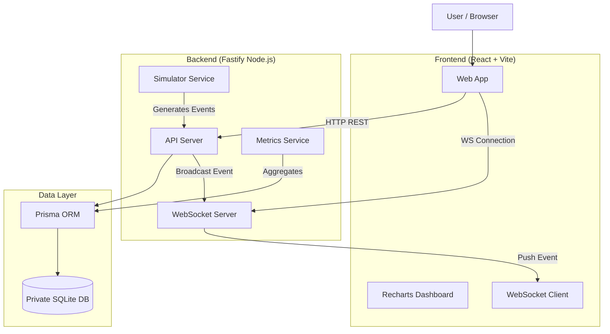

# PulsePay

> **Payment Dashboard**  
> A full-stack Typescript monorepo demonstrating real-time event processing, data visualization, and microservice patterns.

## Overview
PulsePay is a payment processing simulation platform. It mimics the flow of a modern payment gateway (like Stripe) where payments go through various states (Created -> Authorized -> Captured/Failed). 

The goal of this project is to demonstrate:
- **Event-Driven Architecture**: State changes are broadcast via WebSockets.
- **Microservice-ready Structure**: Monorepo with shared packages.
- **Real-time Visualization**: Live feed of payment events.
- **Analytics**: Interactive dashboard with charts deriving metrics from raw data.

## Features
- **📊 Interactive Dashboard**: Real-time metrics and charts showing payment volume, success rates, and failure reasons.
- **💳 Payment Management**: Detailed list of payments with filtering.
- **⚡ Live Event Feed**: WebSocket-powered list of events happening in the system.
- **🤖 Load Simulator**: Built-in tool to generate realistic payment traffic (successes, failures, refunds) to test the system under load.
- **📈 Time-Series Analytics**: Aggregated metrics over time buckets.

## Architecture



## Engineering Decisions

### 1. Monorepo Structure
I chose a `pnpm` workspace monorepo to realistic mimic enterprise environments. 
- `apps/api`: The backend logic.
- `apps/web`: The frontend UI.
- `packages/shared`: Shared TypeScript types and Zod schemas ensures the Frontend and Backend are always in sync (Contract-Driven Development).

### 2. Event-Driven & State Derivation
Instead of just CRUD, the system models payments as a series of events using `PaymentEvent`. The Simulator generates valid state transitions (e.g. you can't Capture before Authorize).
The Dashboard metrics are aggregated from these raw records, mimicking how real analytics pipelines work.

### 3. Type Safety
Strict TypeScript is used throughout. `Zod` handles runtime validation for all API inputs and outputs, ensuring data integrity.

### 4. Testing
- **Backend**: Integration tests using `vitest` and `fastify.inject` run against an isolated test database to ensure API correctness without mocking too much logic.
- **Frontend**: Component composition and separation of concerns (Layout vs Pages).

## Local Development

### Prerequisites
- Node.js 18+
- pnpm

### Setup
```bash
# 1. Install dependencies
pnpm install

# 2. Setup Database
pnpm --filter api prisma:migrate
pnpm --filter api seed

# 3. Start Development Server
pnpm dev
```
Access the web dashboard at `http://localhost:5173`.

### Running Tests
```bash
# Run backend integration tests
pnpm --filter api test
```

## Simulated Demo Script
1. Open `http://localhost:5173/dashboard`.
2. Notice the empty or static charts.
3. Click "Simulator" in the sidebar (or top nav, depending on layout).
4. Click "Start Simulator" (generates 1 payment/sec).
5. Watch the **Live Feed** update instantly.
6. Navigate back to **Dashboard** and verify the "Total Payments" and "Volume" cards incrementing.
7. Click **Refresh List** on the payments page to see the new rows.
